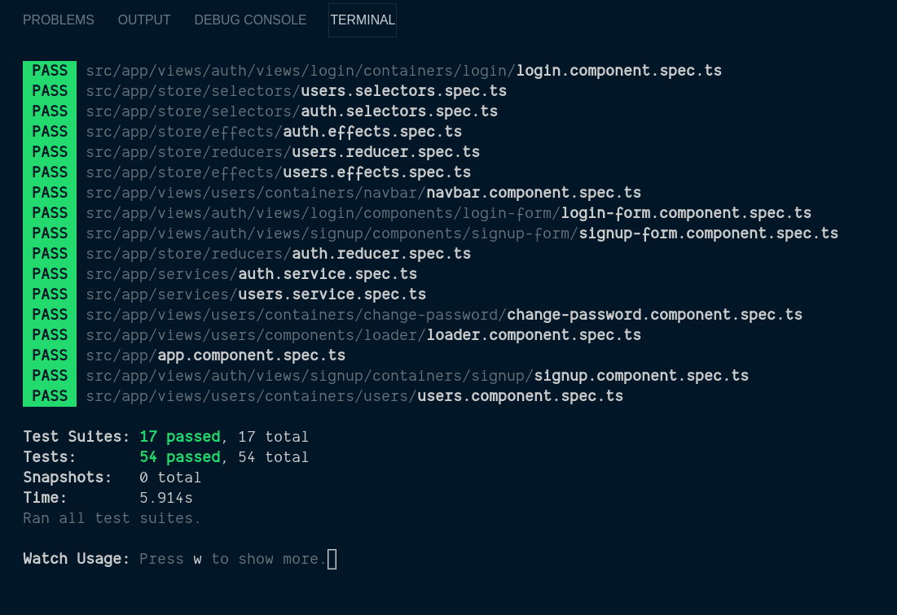
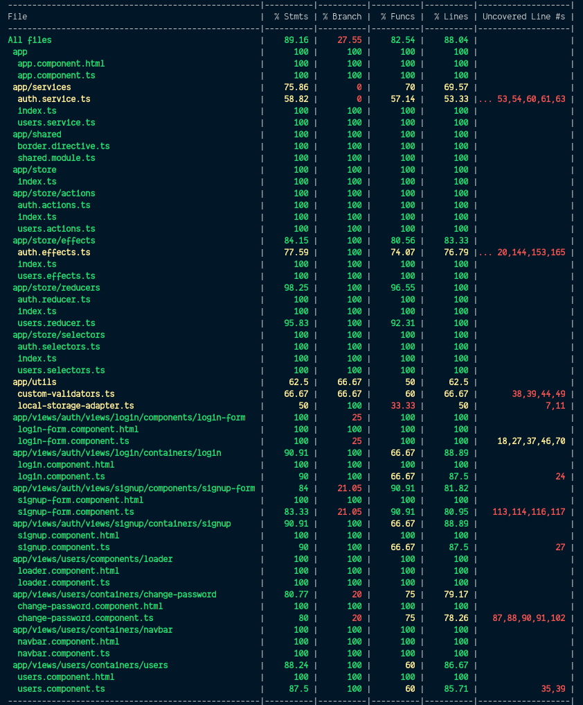

# AngularTask

This project was built with Angular, NGRX Framework and Jest Testing Framework

## How it works

1. Clone the project

2. cd angular-task

3. Run `ng serve` for a dev server. Navigate to `http://localhost:4200/`.

## Running unit tests

`npm run test` then press `a` to run all test cases

### For Jest Coverage `npm run coverage`

### Important note

Note That: Don't use `ng test` to execute the unit tests, Since I am using jest instead of jasmine and karma

## Deployment Link

[Live demo](https://)
